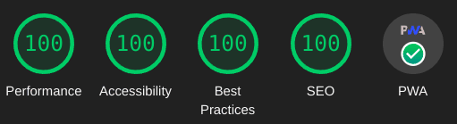

+++
title = "Abridge Zola Theme"
description = "Abridge is a fast and lightweight Zola theme using semantic html, abridge.css class-light CSS, and No Mandatory JS."
date = 2022-05-17T15:00:00Z
updated = 2023-07-21T15:00:00Z
draft = false

[taxonomies]
tags = ["Features","Config"]
[extra]
toc = true
series = "Features"
+++

A fast, lightweight, and modern [Zola](https://getzola.org) theme utilizing [abridge.css](https://github.com/Jieiku/abridge.css) (a class-light semantic HTML CSS Framework). Perfect [Lighthouse](https://pagespeed.web.dev/report?url=abridge.netlify.app), [YellowLabTools](https://yellowlab.tools/), and [Observatory](https://developer.mozilla.org/en-US/observatory/analyze?host=abridge.netlify.app) scores. Here is a [Zola Themes Benchmarks](https://github.com/Jieiku/zola-themes-benchmarks/blob/main/README.md) Page.
<!-- more -->



## Features

- Perfect [Lighthouse](https://pagespeed.web.dev/report?url=abridge.netlify.app), [YellowLabTools](https://yellowlab.tools/), and [Observatory](https://developer.mozilla.org/en-US/observatory/analyze?host=abridge.netlify.app) scores.
- [PWA support](#pwa-progressive-web-app) (Progressive Web Application).
- All JavaScript can be [fully disabled](https://abridge.netlify.app/overview-abridge/#javascript-files).
- Dark, Light, Auto, and Switcher themes. (colors can be customized, css variables)
- Code [syntax highlighting](https://abridge.netlify.app/overview-code-blocks/). (colors can be customized, css variables)
- Numbered code blocks with [line highlighting](https://abridge.netlify.app/overview-code-blocks/#toml).
- Entirely Offline Site by using the PWA **or** by setting `search_library = "offline"` in `config.toml`.
- Multi-language support.
- Search support. ([elasticlunr](https://abridge.pages.dev/), [pagefind](https://abridge-pagefind.pages.dev/), [tinysearch](https://abridge-tinysearch.pages.dev/))
- Search Suggestions navigation keys, `/` focus, `arrow` move, `enter` select, `escape` close.
- Search Results Page, type search query then hit `Enter Key` or `click` the search button icon.
- [SEO](#seo-and-header-tags) support. (Search Engine Optimization)
- [Pagination](#pagination) with numbered paginator on index.
- Title Based Previous and Next Article links at bottom of Article.
- Table of Contents in page Index (Optional, clickable links)
- Recent Posts Block. (Optional)
- Back to Top button. (uses css only)
- Code Blocks copy button.
- Email link in footer obfuscation. (anti-spam)
- [KaTeX](https://katex.org/) support.
- [Archive page](https://abridge.netlify.app/archive/).
- [Tags](https://abridge.netlify.app/tags/).
- Categories. (similar to Tags, disabled/commented out by default)
- Social icon links in footer.
- Responsive design. (mobile first)
- Video Shortcodes: [Youtube](https://abridge.netlify.app/video-streaming-sites/overview-embed-youtube/), [Vimeo](https://abridge.netlify.app/video-streaming-sites/overview-embed-vimeo/), [Streamable](https://abridge.netlify.app/video-streaming-sites/overview-embed-streamable/).
- Media Shortcodes: [video](https://abridge.netlify.app/overview-rich-content/#video), [img](https://abridge.netlify.app/overview-images/#img-shortcode), [imgswap](https://abridge.netlify.app/overview-images/#imgswap-shortcode), [image](https://abridge.netlify.app/overview-rich-content/#image), [gif](https://abridge.netlify.app/overview-rich-content/#gif), [audio](https://abridge.netlify.app/overview-rich-content/#audio).
- Other Shortcodes: [showdata](https://abridge.netlify.app/overview-showdata/), [katex](https://abridge.netlify.app/overview-math/#usage-1).

## Quick Start

This theme requires version {{ showdata(src="https://raw.githubusercontent.com/Jieiku/abridge/master/theme.toml" key="min_version" type="toml") }} or later of [Zola](https://www.getzola.org/documentation/getting-started/installation/)

```bash
git clone https://github.com/jieiku/abridge.git
cd abridge
zola serve
# open http://127.0.0.1:1111/ in the browser
```

## Installation

The Quick Start shows how to run the theme directly. Next we will use abridge as a theme to a NEW site.

### 1: Create a new zola site

```bash
yes "" | zola init mysite
cd mysite
```

### 2: Install Abridge

Add the theme as a git submodule:

```bash
git init  # if your project is a git repository already, ignore this command
git submodule add https://github.com/jieiku/abridge.git themes/abridge
git submodule update --init --recursive
git submodule update --remote --merge
```

Or clone the theme into your themes directory:

```bash
git clone https://github.com/jieiku/abridge.git themes/abridge
```

### 3: Configuration

Copy some files from the theme directory to your project's root directory:

```bash
rsync themes/abridge/.gitignore .gitignore
rsync themes/abridge/config.toml config.toml
rsync themes/abridge/content/_index.md content/
rsync -r themes/abridge/COPY-TO-ROOT-SASS/* sass/
rsync themes/abridge/netlify.toml netlify.toml
rsync themes/abridge/package_abridge.js package_abridge.js
rsync themes/abridge/package.json package.json
```

- `config.toml` base configuration with all config values.
- `content/_index.md` required to set pagination.
- `COPY-TO-ROOT-SASS/abridge.scss` overrides to customize Abridge variables.
- `netlify.toml` settings to deploy your repo with netlfiy.
- `package_abridge.js` node script to: update cache files list in PWA, minify js, bundle js
- `package.json` used by node, defines scripts and dependencies.

Uncomment the theme line in your project's root config.toml:

```bash
sed -i 's/^#theme = "abridge"/theme = "abridge"/' config.toml
```

### 4: Add new content

Copy the content from the theme directory to your project or make a new post:

```bash
rsync -r themes/abridge/content .
```

### 5: Run the project

Just run `zola serve` in the root path of the project:

```bash
zola serve
```

Zola will start the dev web server, accessible by default at `http://127.0.0.1:1111`.

Saved changes will live reload in the browser. (press `ctrl+f5`, or while developing set `pwa=false` in `config.toml`)

## Pagination

You can set the number of home page items by editing `content\_index.md` file and adjusting `paginate_by`

## Sass Overrides

Abridge SASS variables can be overrided by editing `sass\abridge.scss` file in your project's root sass folder.

### Page Width

```scss
$mw:75%,// max-width
```

### Abridge Theme Modes

```scss
$abridgeMode: "switcher",//valid values: switcher, auto, dark, light
```

- switcher: automatically displays a dark or light version depending on browser/OS settings, and has a javascript user clickable theme switcher.
- auto: automatically displays a dark or light version depending on browser/OS settings.
- dark: is the dark theme always.
- light: is the light theme always.

### Colors and Styles

You can specify which color template you want to use as a base:
```scss
$color: "orange",// color template to use/override: orange, blue, blueshade
```

Then override individual colors as needed:
```scss
/// Dark Colors
$f1d: #ccc,// Font Color Primary
$f2d: #ddd,// Font Color Headers
$c1d: #111,// Background Color Primary
$c2d: #222,// Background Color Secondary
...
```

### Footer Social Icons

You should configure which social icons you plan to use. (makes the css file size smaller)

To simply turn them all off you can set `$enable-icons: false` (disables ALL icons, navigation, search, etc.)

Otherwise enable only the icons you need, eg for mail you would set `$icon-mail: true`

You should then disable all the other icons that you do not use.

### Theme for noscript visits

If you have abridge configured to use the switcher mode instead of auto/dark/light, then your site will have a button that allows the visitor to toggle the theme.

If your visitor uses noscript or some other javascript blocking browser addon, then they will be stuck with whatever the configured default theme is for the switcher mode.

To adjust this mode you would set the following two config values in `abridge.scss` **AND** `config.toml`:

```scss
$switcherDefault: "dark",// default nojs switcher mode: dark, light (make sure to also set js_switcher_default in config.toml)
```

```toml
js_switcher_default = "dark" # default nojs switcher mode: dark, light (make sure to also set $switcherDefault in abridge.scss)
```

By default abridge uses dark mode for the switcher, so unless you want to set the default mode to light for nojs/noscript visitors, then you do not need to worry about these settings.

## Config.toml Configuration

Most Options in `config.toml` are self documenting. (obvious between name of config value and comments)

Abridge will work with a barebones `config.toml` because default values are provided in the template files.

I recommend copying the entire config.toml file as outlined in Step 3 as it provides all configurable values.

### Top and Footer menus

Set a field in `extra` with a key of `menu` and `menu_footer`.
If you want the link to open in a new tab/browser then set `blank = true`.
size: s150, s140, s130, s120, s110, s95, s90, s85, s80, s75, s70, false(full size)
If a link should have a trailing slash at the end of the url set `slash = true`.
(generally all links should have a trailing slash unless its a file link such as `sitemap.xml`)

```toml
menu = [
  {url = "about", name = "About", slash = true, blank = false, size="s110"},
  {url = "posts", name = "Posts", slash = true, blank = false, size="s110"},
  {url = "categories", name = "Categories", slash = true, blank = false, size="s110"},
  {url = "tags", name = "Tags", slash = true, blank = false, size="s110"},
]
menu_footer = [
  {url = "about", name = "About", slash = true, blank = false},
  {url = "contact", name = "Contact", slash = true, blank = false},
  {url = "privacy", name = "Privacy", slash = true, blank = false},
  {url = "sitemap.xml", name = "Sitemap", slash = false, blank = true},
]
```

### SEO and Header Tags

You can review the SEO tags in the seo macro located at `templates/macros/seo.html`, all configurable values should be in `config.toml` under `config.extra` or in the content markdown files.

In your post markdown file you should set a title less than 60 characters and a description between 80 and 160 characters in length. The description is what is displayed in search results below the page title. Anywhere that you do not set a page description, the primary site config.description will be used instead.

You should also set page specific keywords unless your keywords defined in config.toml suffice, any keywords that you add to the page are in addition to the ones defined in config.toml, so do not add those same keywords to your page keywords.

You can optionally also set a page specific image for search results by using page.extra.thumbnail. Facebook, Twitter, and OpenGraph Cards are supported (automatic image & description for posted links). OpenGraph recommends 1200 x 630 (1.9:1). Twitter recommends 2:1 for large and 1:1 for small. If you do not set a page specific thumbnail then the banner defined in config.toml will be used instead.

Refer to [overview-images](https://raw.githubusercontent.com/Jieiku/abridge/master/content/overview-images/index.md) for an example:
```md
+++
title = "Image Shortcodes"
description = "Images can be embedded directly using markdown ``, but using a shortcode prevents CLS by explicitly setting the width and height."
date = 2021-05-19
draft = false

[taxonomies]
tags = ["Features","Shortcodes","Images"]
[extra]
toc = true
keywords = "Image, Markdown, Shortcodes, Swap"
thumbnail = "ferris-gesture.png"
+++
```

### KaTeX Math Notation

KaTeX can be used to display complex mathematics, it is a "Fast math typesetting for the web."

You can see a demo on [this page](https://abridge.netlify.app/overview-math/).

For better performance I recommend only enabling math on a [per page bases in your post.md files](https://github.com/Jieiku/abridge/blob/master/content/overview-math.md?plain=1#L11-L13), instead of in your main config.toml file.

### PWA, Progressive Web App

Abridge theme has PWA support. You can install the entire site as an app and have it work offline. To try it out simply use google chrome or your phone and go here: [abridge.netlify.app](https://abridge.netlify.app/)

If using Chrome on desktop then look at the end of the address bar for the install button. On Android you should get a popup to install, you can also install from the 3 dot menu in the top right corner. Once you have the PWA installed, you can go completely offline and you will still be able to browse or search the site!

There is an npm script to generate the file cache list and minification `npm run abridge`. My [netlify.toml](https://github.com/Jieiku/abridge/blob/master/netlify.toml) file automatically runs this npm script during site deployment, so everything is automatic. If Zola was able to template a js file then it might be possible to generate the list of cache files dynamically at build instead of relying on node/npm.

To use a specific list of files instead of all files edit the `pwa_BASE_CACHE_FILES` entry in `config.toml`. If even a single file in the cache list is missing then it wont pre cache the list, so it will only cache as you browse. (If just initially setting up, test with only a couple pages.)

The PWA feature is also easy to disable by simply setting `pwa = false` in `config.toml`

## Performance Optimization

### Javascript files

All javascript can be disabled in `config.toml`:

```toml
build_search_index = false

js_bundle = false
js_copycode = false
js_email_encode = false
js_prestyle = false
js_switcher = false

pwa = false
```

These are the javascript files used by Abridge:

- search_index.en.js: search index generated by zola at each build for elasticlunr.
- elasticlunr.min.js: search library for client side searching.
- search.js: to make use of elasticlunr from our sites search box for both suggestions and the results page.
- email.js: uses javascript to obfuscate your real email address for the mail icon at the bottom of the page.
- codecopy.js: add a Copy Button to code blocks, to copy contents of the code block to clipboard.
- theme.js: tiny script to facilitate local storage for the theme switcher. (never bundle, always separate)
- theme_button.js: tiny script for the theme switcher function when you click the theme switch button.
- prestyle.js: Used to preload css files `<link rel="preload"` - this script changes these to `<link rel="stylesheet"` once the page has finished loading, this allows us to load stylesheets for external fonts, fontawesome, or katex in a non blocking fashion.
- sw.js: this is the Service Worker file for the PWA.
- sw_load.js: this file handles loading the Service Worker for the PWA.

#### js_bundle option

`js_bundle` when set to true serves a bundle file instead of all of the individual js files.

All necessary bundles are dynamically generated by the node script [package_abridge.js](https://github.com/Jieiku/abridge/blob/master/package_abridge.js)

The node script will scan your config.toml for relevant config values, and then based on your config.tomnl generate your required bundles.

All that is necessary is `zola build && npm run abridge`.

#### Switch Search Library

In addition to elasticlunr abridge also supports pagefind and tinysearch.

pagefind demo: https://abridge-pagefind.pages.dev/

tinysearch demo: https://abridge-tinysearch.pages.dev/

To use tinysearch extra steps are required.

**Switch to pagefind:**

```bash
npm install
sed -i 's/^search_library =.*/search_library = "pagefind"/' config.toml
npm run abridge
# zola serve
```

**Switch to elasticlunr:**

```bash
sed -i 's/^search_library =.*/search_library = "elasticlunr"/' config.toml
npm run abridge
```

**Switch to nosearch:**

```bash
sed -i 's/^search_library =.*/search_library = "false"/' config.toml
npm run abridge
```

**Switch to tinysearch:**

First you have to install tinysearch so that you can build the index:

```bash
git clone https://github.com/tinysearch/tinysearch
cd tinysearch
cargo build --release
sudo cp ./target/release/tinysearch /usr/local/bin/tinysearch
exit # reload shell environment
```

Switch Abridge to tinysearch:
```bash
sed -i 's/^search_library =.*/search_library = "tinysearch"/' config.toml
npm run abridge
tinysearch --optimize --path static public/data_tinysearch/index.html
# zola serve
```

#### Theme-Switcher

The theme switcher relies on javascript to work, it applies the .light class to the root documentElement. The file that handles this (`theme.js`) is tiny and optimized and it is the first file loaded in the head, so the performance hit is minimal. Without the Theme switcher you can still use The automatic Theme which uses the Browser/OS preference settings. You can even install a [Firefox plugin](https://addons.mozilla.org/en-US/firefox/addon/theme-switcher-for-firefox/) to quickly switch between the two.

### Optimize PNG/ICO files

Good tool to generate maskable icons for `manifest.json`: [maskable.app](https://maskable.app/editor)

All png files can be optimized using [oxipng](https://github.com/shssoichiro/oxipng):

```bash
cd static
oxipng -o max --strip all -a -Z *.png
```

With larger displays and greater pixel density becoming common it is probably a good idea to use atleast a littly bit of lossy compression. For example you can use pngquant with a 93% quality and you will often get images around 1/2 the size. Understand that pngquant is cumulative, so you should keep your original images somewhere, and only ever use pngquant once per image, if you use it again and again on the same image then you will lower the image quality each time. Always use oxipng afterwards, oxipng is lossless.

```bash
pngquant --skip-if-larger --strip --quality=93-93 --speed 1 *.png
oxipng -o max --strip all -a -Z *.png
```

leanify can compress farther for both png and ico files:

```bash
git clone https://github.com/JayXon/Leanify
cd Leanify
make
sudo cp leanify /usr/local/bin/leanify
exit  #launch new terminal
leanify -i 7777 *.png
leanify -i 7777 *.ico
```

### Pre gzip/brotli content

If you are serving your site with nginx, you can pre gzip your content.

(Netlify brotli gzips your files automatically, no exta work required.)

First configure nginx:

```bash
sudo nano /etc/nginx/nginx.conf

gzip on;
gzip_vary on;
gzip_proxied expired no-cache no-store private auth;
#gzip_proxied any;
gzip_comp_level 9;
gzip_buffers 64 16k;
#gzip_buffers 16 8k;
gzip_http_version 1.1;
gzip_types text/plain text/css application/json application/javascript text/xml application/xml application/xml+rss text/javascript image/svg+xml application/xhtml+xml application/x-javascript application/x-font-ttf application/vnd.ms-fontobject font/opentype font/ttf font/eot font/otf;
#gzip_types text/plain text/css application/json application/javascript text/xml application/xml application/xml+rss text/javascript;
```

Then you can gzip/brotli your files:

```bash
zola build
find ~/.dev/abridge/public -type f -regextype posix-extended -regex '.*\.(htm|html|css|js|xml|xsl|txt|woff|woff2|svg|otf|eot|ttf)' -exec gzip --best -k -f {} \+ -exec brotli --best -f {} \;
rsync -zvrh ~/.dev/abridge/public/ web:/var/www/abridge
```

Nginx does not come by default with brotli support, but adding it was not difficult.
