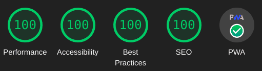

+++
date = 2022-05-17T15:00:00Z
description = "Abridge é um tema Zola rápido e leve que usa HTML semântico, CSS com poucas classes em abridge.css e nenhum JavaScript obrigatório."
draft = false
title = "Tema Abridge para Zola"
updated = 2023-07-21T15:00:00Z

[extra]
series = "Recursos"
toc = true

[taxonomies]
tags = [
    "Recursos",
    "Config",
]
+++
Um tema [Zola](https://getzola.org) rápido, leve e moderno que utiliza HTML semântico com poucas classes e CSS modular. Pontuações perfeitas em [Lighthouse](https://pagespeed.web.dev/report?url=abridge.pages.dev), [YellowLabTools](https://yellowlab.tools/), and [Observatory](https://developer.mozilla.org/en-US/observatory/analyze?host=abridge.pages.dev) scores. Here is a [Zola Themes Benchmarks](https://github.com/Jieiku/zola-themes-benchmarks/blob/main/README.md) Page.

<!-- more -->

{{}}

## Recursos

- Pontuações perfeitas no [Lighthouse](https://pagespeed.web.dev/report?url=abridge.pages.dev), [YellowLabTools](https://yellowlab.tools/), and [Observatory](https://developer.mozilla.org/en-US/observatory/analyze?host=abridge.pages.dev) scores.
- [Suporte a PWA](#pwa) (Progressive Web Application).
- Todo o JavaScript pode ser [fully disabled](https://abridge.pages.dev/overview-abridge/#javascript-files).
- Temas Escuro, Claro, Automático e Alternável. (as cores podem ser personalizadas por variáveis CSS)
- [Realce de sintaxe] de código(https://abridge.pages.dev/overview-code-blocks/). (colors can be customized, css variables)
- Blocos de código numerados com [line highlighting](https://abridge.pages.dev/overview-code-blocks/#toml).
- Site totalmente offline usando o PWA **ou** definindo `search_library = "offline"` in `zola.toml`.
- Suporte a vários idiomas.
- Suporte a pesquisa. ([elasticlunr](https://abridge.pages.dev/), [pagefind](https://abridge-pagefind.pages.dev/), [tinysearch](https://abridge-tinysearch.pages.dev/), [flexsearch](https://abridge-flexsearch.pages.dev/))
- Teclas de navegação das sugestões de pesquisa: `/` foca, `setas` movem, `enter` seleciona e `escape` fecha.
- Página de resultados de pesquisa: digite a consulta e pressione `Enter` ou clique no ícone do botão de pesquisa.
- Suporte a [SEO](#seo) (otimização para mecanismos de busca).
- [Paginação](#pagination) com paginador numerado no índice.
- Links para o artigo anterior e seguinte, baseados no título, no final do artigo.
- Sumário no índice da página (opcional, com links clicáveis).
- Bloco de posts recentes (opcional).
- Botão Voltar ao Topo (usa apenas CSS).
- Botão para copiar blocos de código.
- Ofuscação do link de e-mail no rodapé (antispam).
- Suporte a [KaTeX](https://katex.org/).
- [Página de arquivo](https://abridge.pages.dev/archive/).
- [Tags](https://abridge.pages.dev/tags/).
- Categorias (semelhantes às Tags, desativadas/comentadas por padrão).
- Links de ícones sociais no rodapé.
- Design responsivo (mobile first).
- Vídeo Componentes: [YouTube](https://abridge.pages.dev/video-streaming-sites/overview-embed-youtube/), [Vimeo](https://abridge.pages.dev/video-streaming-sites/overview-embed-vimeo/), [Streamable](https://abridge.pages.dev/video-streaming-sites/overview-embed-streamable/).
- Media Componentes: [video](https://abridge.pages.dev/overview-rich-content/#video), [img](https://abridge.pages.dev/overview-images/#img-component), [imgswap](https://abridge.pages.dev/overview-images/#imgswap-component), [image](https://abridge.pages.dev/overview-rich-content/#image), [gif](https://abridge.pages.dev/overview-rich-content/#gif), [audio](https://abridge.pages.dev/overview-rich-content/#audio).
- Other Componentes: [showdata](https://abridge.pages.dev/overview-showdata/), [katex](https://abridge.pages.dev/overview-math/#usage-1).

## Usuários do Windows

Abaixo, uso alguns comandos Linux durante a configuração. Para criar um ambiente semelhante no Windows, você pode instalar [MSYS2](https://www.msys2.org/).
No MSYS2, use Shift+Insert para colar no terminal; prefiro o inicializador UCRT64.

```bash
MSYS2
pacman -Syu
pacman -S --needed mingw-w64-ucrt-x86_64-git mingw-w64-ucrt-x86_64-zola mingw-w64-ucrt-x86_64-uutils-coreutils rsync
```

## Início Rápido

Este tema requer a versão {{<showdata src="https://raw.githubusercontent.com/Jieiku/abridge/master/theme.toml" key="min_version" type="toml" page={page} config={config} />}} ou posterior do [Zola](https://www.getzola.org/documentation/getting-started/installation/)

```bash
git clone https://github.com/jieiku/abridge.git
cd abridge
zola serve
# open http://127.0.0.1:1111/ in the browser
```

## Instalação

O Início Rápido mostra como executar o tema diretamente. Em seguida, usaremos o Abridge como tema de um NOVO site.

### 1: Criar um novo site Zola

```bash
yes "" | zola init mysite
cd mysite
```

### 2: Instalar o Abridge

Adicione o tema como um submódulo Git:

```bash
git init  # if your project is a git repository already, ignore this command
git submodule add https://github.com/jieiku/abridge.git themes/abridge
git submodule update --init --recursive
git submodule update --remote --merge
```

Ou clone o tema no diretório de temas:

```bash
git clone https://github.com/jieiku/abridge.git themes/abridge
```

### 3: Configuração

Copie alguns arquivos do diretório do tema para o diretório raiz do projeto:

```bash
rsync themes/abridge/.gitignore .gitignore
rsync themes/abridge/zola.toml zola.toml
rsync themes/abridge/content/_index.md content/
rsync -r themes/abridge/COPY-TO-ROOT-SASS/* sass/
rsync themes/abridge/netlify.toml netlify.toml
rsync themes/abridge/package_abridge.js package_abridge.js
rsync themes/abridge/package.json package.json
```

- `zola.toml`: configuração básica com todos os valores configuráveis.
- `content/_index.md`: necessário para definir a paginação.
- `COPY-TO-ROOT-SASS/abridge.scss`: sobrescritas para personalizar as variáveis do Abridge.
- `netlify.toml`: configurações para implantar seu repositório no Netlify.
- `package_abridge.js`: script Node para atualizar a lista de arquivos em cache do PWA, minificar JS e agrupar JS.
- `package.json`: usado pelo Node para definir scripts e dependências.

Descomente a linha do tema no `zola.toml` da raiz do projeto:

```bash
sed -i 's/^#theme = "abridge"/theme = "abridge"/' zola.toml
```

### 4: Adicionar novo conteúdo

Copie o conteúdo do diretório do tema para o projeto ou crie um novo post:

```bash
rsync -r themes/abridge/content .
```

### 5: Executar o projeto

Execute `zola serve` no diretório raiz do projeto:

```bash
zola serve
```

O Zola iniciará o servidor web de desenvolvimento, acessível por padrão em `http://127.0.0.1:1111`.

As alterações salvas serão recarregadas automaticamente no navegador. (press `ctrl+f5`, or while developing set `pwa=false` in `zola.toml`)

## Auxiliar de compilação do Abridge

Instale as dependências com `npm install` e execute uma compilação normal com:

```bash
npm run abridge
```

As demonstrações alternativas de pesquisa usam um modo de compilação explícito:

```bash
npm run abridge -- --mode elasticlunr --base-url https://abridge.pages.dev
npm run abridge -- --mode pagefind --base-url https://abridge-pagefind.pages.dev
npm run abridge -- --mode tinysearch --base-url https://abridge-tinysearch.pages.dev
npm run abridge -- --mode flexsearch --base-url https://abridge-flexsearch.pages.dev
npm run abridge -- --mode offline --drafts
npm run abridge -- --mode offlineflexsearch --drafts
```

Os modos válidos são `elasticlunr`, `pagefind`, `tinysearch`, `flexsearch`, `offline`, `offlineflexsearch`, and `elasticlunrjava`.

`build-zola.sh` auxilia na implantação no Cloudflare, Netlify e serviços semelhantes. Ele funciona a partir do repositório Abridge ou de um site como `./themes/abridge/build-zola.sh`. O script lê `theme.toml` para selecionar automaticamente a versão correta do Zola.

## Paginação {#pagination}

Você pode definir o número de itens da página inicial editando `content\_index.md` e ajustando `paginate_by`

## Sobrescritas Sass

As variáveis SASS do Abridge podem ser sobrescritas editando `sass\abridge.scss` na pasta Sass raiz do projeto.

### Largura da Página

```scss
$mw:75%,// max-width
```

### Modos de Tema do Abridge

```scss
$abridgeMode: "switcher",//valid values: switcher, auto, dark, light
```

- switcher: exibe automaticamente a versão escura ou clara conforme as configurações do navegador/SO e inclui um alternador de tema JavaScript selecionável pelo usuário.
- auto: exibe automaticamente a versão escura ou clara conforme as configurações do navegador/SO.
- dark: usa sempre o tema escuro.
- light: usa sempre o tema claro.

### Cores e Estilos

Você pode especificar qual modelo de cores deseja usar como base:

```scss
$color: "orange",// color template to use/override: orange, blue, blueshade
```

Depois, sobrescreva as cores individuais conforme necessário:

```scss
/// Dark Colors
$f1d: #ccc,// Font Color Primary
$f2d: #ddd,// Font Color Headers
$c1d: #111,// Background Color Primary
$c2d: #222,// Background Color Secondary
...
```

### Ícones Sociais do Rodapé

Configure apenas os ícones sociais que pretende usar. (isso reduz o tamanho do arquivo CSS)

Para desativar todos, você pode definir `$enable-icons: false` (disables ALL icons, navigation, search, etc.)

Caso contrário, ative apenas os ícones necessários; por exemplo, para e-mail, defina `$icon-mail: true`

Em seguida, desative todos os outros ícones que não utiliza.

### Tema para visitas sem JavaScript

Se o Abridge estiver configurado para usar o modo alternável em vez de automático/escuro/claro, o site terá um botão que permite ao visitante alternar o tema.

Se o visitante usar noscript ou alguma extensão que bloqueie JavaScript, ele permanecerá com o tema padrão configurado para o modo alternável.

Para ajustar esse modo, defina os dois valores de configuração a seguir em `abridge.scss` **E** `zola.toml`:

```scss
$switcherDefault: "dark",// default nojs switcher mode: dark, light (make sure to also set js_switcher_default in zola.toml)
```

```toml
js_switcher_default = "dark" # default nojs switcher mode: dark, light (make sure to also set $switcherDefault in abridge.scss)
```

Por padrão, o Abridge usa o modo escuro no alternador; portanto, a menos que queira definir o modo claro como padrão para visitantes sem JavaScript, não é necessário alterar essas configurações.

## Configuração do zola.toml

A maioria das opções em `zola.toml` é autoexplicativa por seus nomes e comentários.

O Abridge funciona com um `zola.toml` mínimo porque os arquivos de template fornecem valores padrão.

Recomendo copiar o arquivo `zola.toml` completo, conforme descrito na Etapa 3, pois ele contém todos os valores configuráveis.

### Menus superior e do rodapé

Defina em `extra` os campos `menu` e `menu_footer`.
Se quiser que o link abra em uma nova aba/janela, defina `blank = true`.
size: s150, s140, s130, s120, s110, s95, s90, s85, s80, s75, s70, false(full size)
Se um link deve terminar com uma barra, defina `slash = true`.
(em geral, todos os links devem terminar com uma barra, exceto links para arquivos como `sitemap.xml`)

```toml
menu = [
  {url = "about", name = "About", slash = true, blank = false, size="s110"},
  {url = "posts", name = "Posts", slash = true, blank = false, size="s110"},
  {url = "categories", name = "Categories", slash = true, blank = false, size="s110"},
  {url = "tags", name = "Tags", slash = true, blank = false, size="s110"},
]
menu_footer = [
  {url = "about", name = "About", slash = true, blank = false},
  {url = "contact", name = "Contact", slash = true, blank = false},
  {url = "privacy", name = "Privacy", slash = true, blank = false},
  {url = "sitemap.xml", name = "Sitemap", slash = false, blank = true},
]
```

### SEO e Tags de Cabeçalho {#seo}

Você pode revisar as tags de SEO no componente localizado em `templates/components/seo.html`; todos os valores configuráveis devem estar em `zola.toml`, sob `config.extra`, ou nos arquivos Markdown de conteúdo.

No arquivo Markdown do post, defina um título com menos de 60 caracteres e uma descrição entre 80 e 160 caracteres. A descrição é exibida nos resultados de pesquisa abaixo do título da página. Quando uma página não tiver descrição, será usado o `config.description` principal do site.

Também defina palavras-chave específicas da página quando as palavras-chave de `zola.toml` não forem suficientes. As palavras-chave da página são adicionadas às definidas em `zola.toml`, portanto não repita as mesmas palavras-chave.

Opcionalmente, você pode definir uma imagem específica da página para os resultados de pesquisa usando `page.extra.thumbnail`. Há suporte a cartões do Facebook, Twitter e OpenGraph (imagem e descrição automáticas para links compartilhados). O OpenGraph recomenda 1200 x 630 (1,9:1). O Twitter recomenda 2:1 para imagens grandes e 1:1 para pequenas. Se nenhuma miniatura específica for definida, será usado o banner configurado em `zola.toml`.

Consulte [overview-images](https://raw.githubusercontent.com/Jieiku/abridge/master/content/overview-images/index.md) para ver um exemplo.

```md
+++
[extra]
thumbnail = "ferris-gesture.png"
+++
```

### Notação Matemática com KaTeX

O KaTeX pode ser usado para exibir matemática complexa; ele oferece “composição matemática rápida para a web”.

Você pode ver uma demonstração [nesta página](https://abridge.pages.dev/overview-math/).

O KaTeX é carregado automaticamente em páginas ou seções que usam o componente `katex`. A configuração `math = true` não é necessária. Se usar delimitadores brutos `$...$` ou `$$...$$`, ative `math_auto_render = true` para essa página/seção (ou globalmente, se desejar).

### PWA, Aplicativo Web Progressivo {#pwa}

O tema Abridge oferece suporte a PWA. Você pode instalar o site inteiro como um aplicativo e usá-lo offline. Para testar, use o Google Chrome ou seu celular e acesse: [abridge.pages.dev](https://abridge.pages.dev/)

No Chrome para desktop, procure o botão de instalação no fim da barra de endereços. No Android, deve aparecer uma janela para instalar; também é possível instalar pelo menu de três pontos no canto superior direito. Depois de instalar o PWA, você pode ficar totalmente offline e ainda navegar ou pesquisar no site!

Há um script npm para gerar a lista de arquivos em cache e fazer a minificação: `npm run abridge`. Meu arquivo [netlify.toml](https://github.com/Jieiku/abridge/blob/master/netlify.toml) executa automaticamente esse script npm durante a implantação do site. Se o Zola pudesse processar um arquivo JS como template, talvez fosse possível gerar dinamicamente a lista de arquivos em cache durante a compilação, sem depender de Node/npm.

Para usar uma lista específica de arquivos em vez de todos os arquivos, edite `pwa_BASE_CACHE_FILES` em `zola.toml`. Se faltar até mesmo um arquivo da lista, o pré-cache não será feito e os arquivos serão armazenados conforme você navega. (Durante a configuração inicial, teste com apenas algumas páginas.)

O recurso PWA também pode ser desativado facilmente definindo `pwa = false` em `zola.toml`.

## Otimização de Desempenho

### Arquivos JavaScript

Todo o JavaScript pode ser desativado em `zola.toml`:

```toml
build_search_index = false

js_bundle = false
js_copycode = false
js_email_encode = false
js_prestyle = false
js_switcher = false

pwa = false
```

Estes são os arquivos JavaScript usados pelo Abridge:

- search_index.en.js: índice de pesquisa gerado pelo Zola em cada compilação para o elasticlunr.
- elasticlunr.min.js: biblioteca de pesquisa no lado do cliente.
- search.js: usa o elasticlunr na caixa de pesquisa do site, tanto para sugestões quanto para a página de resultados.
- email.js: usa JavaScript para ofuscar seu endereço de e-mail real no ícone de e-mail no rodapé.
- codecopy.js: adiciona um botão Copiar aos blocos de código para copiar seu conteúdo para a área de transferência.
- theme.js: pequeno script que gerencia o armazenamento local do alternador de tema. (nunca agrupar; manter sempre separado)
- theme_button.js: pequeno script para a função do alternador quando o botão de tema é clicado.
- prestyle.js: usado para pré-carregar arquivos CSS com `<link rel="preload"`; após o carregamento da página, altera-os para `<link rel="stylesheet">`, permitindo carregar folhas de estilo de fontes externas, Font Awesome ou KaTeX sem bloquear a página.
- sw.js: arquivo do Service Worker do PWA.
- sw_load.js: responsável por carregar o Service Worker do PWA.

#### Opção js_bundle

Quando `js_bundle` é definido como true, um arquivo agrupado é servido no lugar dos arquivos JS individuais.

Todos os bundles necessários são gerados dinamicamente pelo script Node [package_abridge.js](https://github.com/Jieiku/abridge/blob/master/package_abridge.js)

O script Node examina `zola.toml` em busca dos valores relevantes e gera os bundles necessários com base nessa configuração.

Basta executar `zola build && npm run abridge`.

#### Alternador de Tema

O alternador de tema usa JavaScript para aplicar a classe `.light` ao `documentElement` raiz. O arquivo otimizado `theme.js` é carregado primeiro no head, portanto seu impacto no desempenho é mínimo. Sem o alternador, o tema automático ainda pode seguir a preferência do navegador/sistema operacional. Você também pode instalar uma [extensão do Firefox](https://addons.mozilla.org/en-US/firefox/addon/theme-switcher-for-firefox/) para alternar rapidamente entre os dois.

### Otimizar arquivos PNG/ICO

Uma boa ferramenta para gerar ícones mascaráveis para `manifest.json`: [maskable.app](https://maskable.app/editor)

Todos os arquivos PNG podem ser otimizados usando [oxipng](https://github.com/shssoichiro/oxipng):

```bash
cd static
oxipng -o max --strip all -a -Z *.png
```

Com telas maiores e densidades de pixels mais altas se tornando comuns, é recomendável usar ao menos um pouco de compressão com perdas. For example you can use pngquant with a 93% quality and you will often get images around 1/2 the size. Understand that pngquant is cumulative, so you should keep your original images somewhere, and only ever use pngquant once per image, if you use it again and again on the same image then you will lower the image quality each time. Always use oxipng afterwards, oxipng is lossless.

```bash
pngquant --skip-if-larger --strip --quality=93-93 --speed 1 *.png
oxipng -o max --strip all -a -Z *.png
```

O leanify pode comprimir ainda mais arquivos PNG e ICO:

```bash
git clone https://github.com/JayXon/Leanify
cd Leanify
make
sudo cp leanify /usr/local/bin/leanify
exit  #launch new terminal
leanify -i 7777 *.png
leanify -i 7777 *.ico
```

### Pré-comprimir conteúdo com gzip/brotli

Se você serve o site com nginx, pode pré-comprimir o conteúdo com gzip.

(O Netlify comprime seus arquivos automaticamente com Brotli/gzip, sem trabalho adicional.)

Primeiro, configure o nginx:

```bash
sudo nano /etc/nginx/nginx.conf

gzip on;
gzip_vary on;
gzip_proxied expired no-cache no-store private auth;
#gzip_proxied any;
gzip_comp_level 9;
gzip_buffers 64 16k;
#gzip_buffers 16 8k;
gzip_http_version 1.1;
gzip_types text/plain text/css application/json application/javascript text/xml application/xml application/xml+rss text/javascript image/svg+xml application/xhtml+xml application/x-javascript application/x-font-ttf application/vnd.ms-fontobject font/opentype font/ttf font/eot font/otf;
#gzip_types text/plain text/css application/json application/javascript text/xml application/xml application/xml+rss text/javascript;
```

Depois, você pode comprimir os arquivos com gzip/Brotli:

```bash
zola build
find ~/.dev/abridge/public -type f -regextype posix-extended -regex '.*\.(htm|html|css|js|xml|xsl|txt|woff|woff2|svg|otf|eot|ttf)' -exec gzip --best -k -f {} \+ -exec brotli --best -f {} \;
rsync -zvrh ~/.dev/abridge/public/ web:/var/www/abridge
```

O nginx não inclui suporte a Brotli por padrão, mas adicioná-lo não foi difícil.
