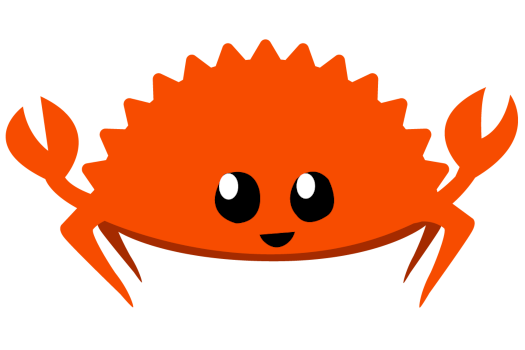
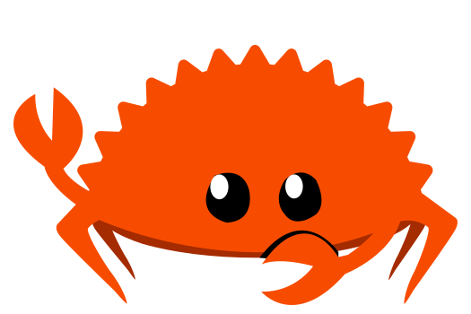

+++
title = "Image Examples"
date = 2021-05-09

[taxonomies]
categories = ["Features"]
tags = ["images"]
+++

Images can be embed using direct or relative paths.
<!-- more -->

PNG image with alt note using markdown:

``

SVG image with with alt note using markdown:

``

SVG image directly in code:

<svg xmlns="http://www.w3.org/2000/svg" xml:space="preserve" viewBox="0 0 525 425" width="525" height="425"><g fill="#8f1f1d"><path d="M53 285c7 7 20 3 28 8 4 7-6 13-8 20-2 13 16 8 24 9 11-2 7 10 5 16-7 12 7 16 16 11 7-2 18-2 15 8s0 25 13 17c7-1 14-8 20-4 3 9-1 23 11 25 8-2 15-10 22-12 8 2 8 13 12 19 8 11 17-4 24-9 7-7 12 5 16 10 5 13 17 6 21-4 4-9 13-9 18-1 5 9 19 15 21 1 3-6 6-18 15-12 7 4 18 17 24 6 4-6 1-18 8-20 9-1 18 9 28 7 7-6 0-18 4-25 6-5 15 2 22 2 15 4 9-13 7-21-4-10 9-8 15-8 12 5 21-5 12-15-6-7-6-17 5-15 9-1 27-3 17-14-9-8-13-19-15-30-14-34-53-48-86-58-75-20-157-21-231 4-31 10-62 30-69 64-5 7-14 13-14 21Z"/><path d="M502 214c-15-3-32-1-47-2-6-7 4-14 7-20l17-28c-9-1-19 3-29 4-7-1-18 8-21-1 0-7 6-14 8-21 6-14 13-26 16-41-17 8-33 20-50 30-9-3-1-13 0-20 3-13 9-26 10-40-13 5-24 17-36 25-5 8-17 9-13-2 3-19 8-38 9-57-10 1-18 15-25 23l-18 24c-10-1-5-13-6-20-2-15-1-31-4-46-8 4-11 17-16 25l-15 30c-10 2-7-11-10-18-3-14-5-30-11-44-8 2-8 19-11 28l-10 34c-9 3-8-11-13-16-6-14-11-28-19-41-5 6-3 19-5 28l-4 38c-8 6-11-8-17-12-7-7-16-29-23-23l1 53c-7 7-12-6-18-9-10-8-18-19-29-23-3 14 5 29 8 43 1 7 8 19-2 20-15-9-29-20-45-27-1 7 6 16 8 24l13 33c-3 11-13 2-20 1-17-6-34-13-52-17-2 7 11 15 16 22l32 36c-2 10-12 3-19 4-12-1-23-4-34-3-2 8 12 15 16 23 11 13 29 22 25 43 14 50 66 75 112 88 75 19 158 15 226-21 34-18 61-51 65-89 11-13 24-24 33-38z"/><path d="m79 253-64 10c3 9 36 4 50 7 10-2 43 7 23-8l-9-9Zm365 3c22 4 45 5 66 11-14 8-38 4-55 6-11 0-38 6-19-8l8-9Z"/></g><path d="M196 256c-14-18-46-9-48 14-11 23 12 47 35 42 24-7 26-38 13-56z"/><path fill="#fff" d="M171 265c-1 28 36 11 22-9-6-15-24-4-22 9z"/><path d="M316 247c-20-11-48 3-48 27-6 24 21 48 42 34 27-11 20-42 6-61z"/><path fill="#fff" d="M298 263c-1 29 36 13 22-9-6-16-24-4-22 9z"/></svg>

PNG image using an img shortcode:

<pre>
&lbrace;&lbrace; img(path="./rustacean-flat-noshadow-525.png", alt="Ferris the crab, unofficial mascot for Rust") &rbrace;&rbrace;
</pre>

{{ img(path="./rustacean-flat-noshadow-525.png", alt="Ferris the crab, unofficial mascot for Rust") }}
